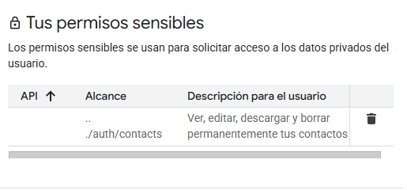
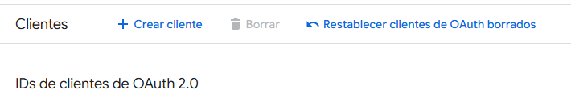
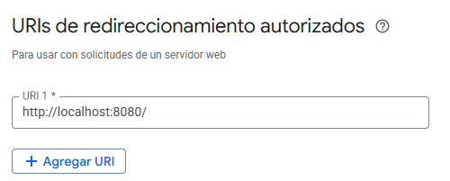

# People API para Google Contacts

## Resumen

El objetivo de este repositorio es administrar contactos en Google Contacts a través de la API de Google llamada People API usando Python.

El servicio de API es gratuito siempre y cuando no se supuere una cuota diaria.

## Prerrequisitos de la cuenta de Google

- Con un navegador acceder al siguiente enlace y crear un nuevo proyecto:
https://console.cloud.google.com/projectselector2/auth/


- Una vez elegido el proyecto, en la columna de la izquierda acceder a "acceso a los datos" y añadir el permiso de editar contactos.
La seccion de permisos sensibles debería de aparecer así:



- En la columna de la izquierda ir al apartado clientes para crear un nuevo cliente de "aplicacion web":



- Saldrá un popup con la información del cliente, descargar el json con las claves para usar en el proyecto. Si no se hace en este popup hay que crear un secreto nuevo


- En su sección de URIs añadir localhost y el puerto 8080 para autenticación local y generación del token:


## Prerrequisitos en local
Teniendo Python instalado creamos un entorno virtual y le instalamos los requisitos del requirements.txt de la raíz del proyecto.
El siguiente ejemplo sirve para Windows:

```bat
python -m venv venv
.\venv\Scripts\activate
pip install -r requirements.txt
```

Después tenemos que poblar la carpeta "data" con el archivo que hemos descargado al configurar el cliente, nombrandolo "credentials.json"

## Uso
En main.py hay un caso de prueba que realiza un guardado, una busqueda, un borrado y otra busqueda para demostrar el funcionamiento básico de la API. Para ejecutarlo simplemente lanzar main.py desde la raiz del proyecto

```bat
python main.py
```